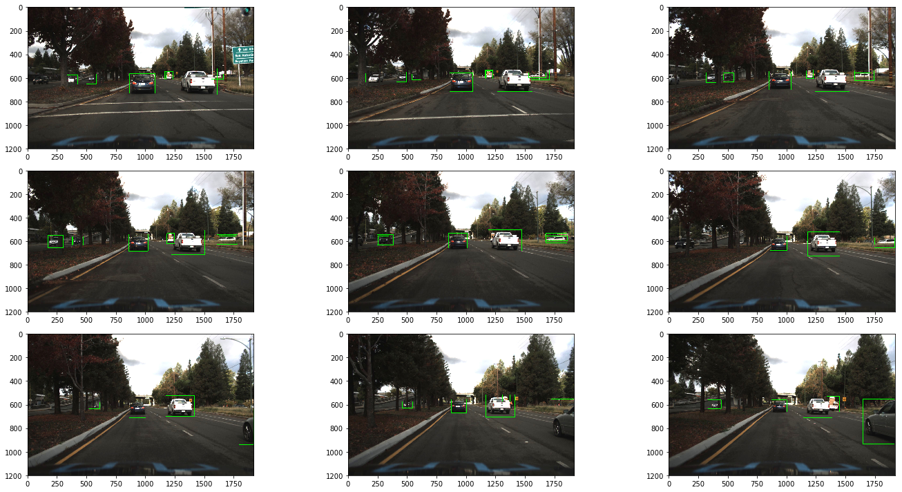
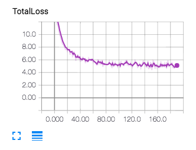
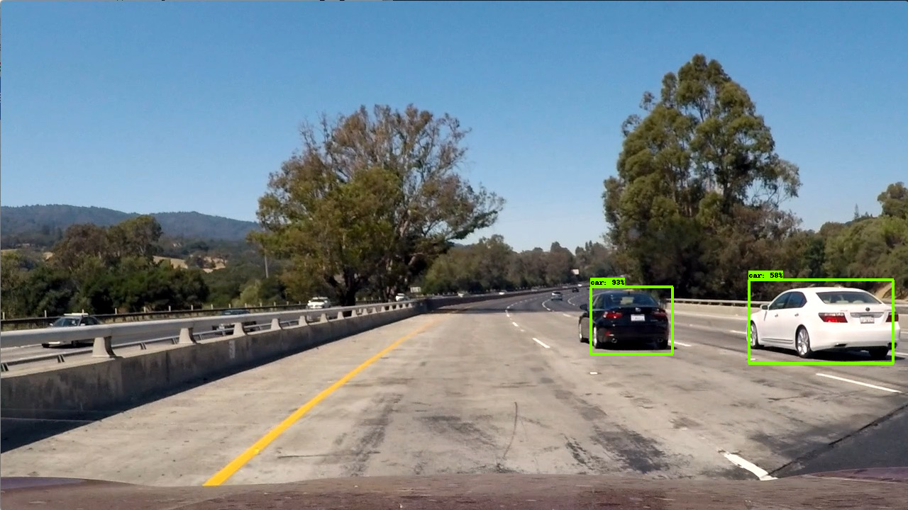
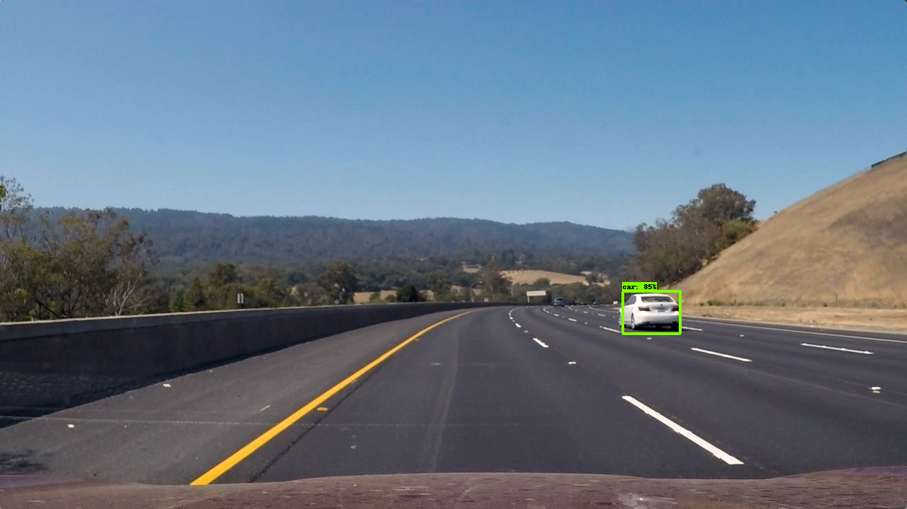
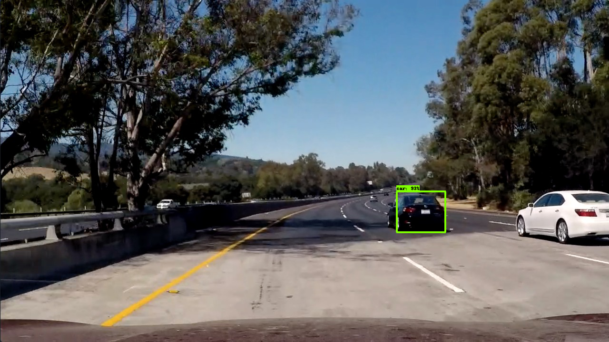

# Vehicle Detection Project

The goals / steps of this project are the following:

* Estimate a bounding box for vehicles detected in a video
* [project code](det_vehicles.py)
* [data preprocessing](tfobjdet.ipynb)
* [project result video](out_project_video.mp4)

## [Rubric](https://review.udacity.com/#!/rubrics/513/view) Points

### SSD (Single Shot Object Detector)

For this project I used a deep learning based detector using [Tensorflow Object Detection API](https://github.com/tensorflow/models/tree/master/object_detection). This tensorflow api comes with an SSD detector which is pre-trained on the MS COCO dataset with an inceptionv2 architecture as the convnet front end. For this project I decided to use this base detector as my starting point.

Off the bat the detector did not perform well on the test images. This is to be expected since the checkpoint provided by tensorflow is just a starting point. In order to fine tune this SSD detector I used the [udacity vehicle annotation dataset](https://github.com/udacity/self-driving-car/tree/master/annotations). The dataset comes with a set of labeled images with cars, trucks and pedestrian labels. Within this dataset there are two datasets from crowd-ai and autti.

Here's an example of a collection of images with car labels from the crowd-ai dataset


Here's an example of a collection of images with car labels from the second dataset from autti


### Pre processing training dataset

The tensorflow object detection api requires data to be described as a tensorflow record prior to training. I converted both the datasets into this form. The conversion code is located in the file [tfobjdet.ipynb](tfobjdet.ipynb) in the last cell of the python notebook.

The dataset labels were read in from a cvs file and everything was merged into a single pandas dataframe. Eventuallly this pandas dataframe is split into training and test data using [train_test_split](http://scikit-learn.org/stable/modules/generated/sklearn.model_selection.train_test_split.html). I used 20% of the dataset for validating the detector.

### Training on dataset

The dataset finally matched the following folder structure
```
data
    train.record
    eval.record
    car_label_map.pbtxt
    sd_inception_v2_car.config
train
eval
model
    ssd_model.ckpt
```

The hyper parameters for the training algorithm are described in [ssd_inception_v2_car.config](ssd_inception_v2_car.config) which is also referred to by the tensorflow object detection api documentation as the pipeline configuration file.

#### Training in the cloud 
Training object detectors with convolutional neural networks requires a good GPU and so I decided to use the Amazon EC2 p2.xlarge machine instance type for this project. The environment setup and installation was done with anaconda. I followed this [tutorial](https://chrisalbon.com/jupyter/run_project_jupyter_on_amazon_ec2.html) to setup jupyter notebooks for experimenting. In order to save cost I first used a t2.small machine instance on EC2 to setup the data pipeline for transforming the datasets in to the format required by the api for training and testing. For actual training I used a p2.xlarge instance type.

### Training scripts

Tensorboard visualization for this project was critical to understand if the training was succeeding or not. Here is a snapshot of the tensorboard loss plot.



The training, evaluation and tensorboard scripts were launched with commands similar to the one described in this [running locally](https://github.com/tensorflow/models/blob/master/object_detection/g3doc/running_locally.md) page.

### Results on test images

Here are some results of the SSD detector on test images.





While the detector does well on first two images, it misses the white vehicles on the 3rd example.

### Smoothing results using past history

To handle cases where the detector did not detect the vehicles in a frame I used a heatmap of past N frames and thresholded the detections to obtain a mask image. Through experimentation I determined that a history of 5 frames was sufficient to obtain better and smoother detection results. This code is in the smooth_detections() function in [det_vehicles.py](det_vehicles.py)

Here's a mask output image of thresholded regions in an image
 


From this mask the bounding boxes are obtained using two successive OpenCV cv2.findContours() function followed by cv2.boundingRect() function.

### Video Implementation
Here's a [link to my video result](./out_project_video.mp4)

---

### Discussion

#### Briefly discuss any problems / issues you faced in your implementation of this project.  Where will your pipeline likely fail?  What could you do to make it more robust?

Here I'll talk about the approach I took, what techniques I used, what worked and why, where the pipeline might fail and how I might improve it if I were going to pursue this project further.  

I first tried to a simpler deep learning approach where a classifier fully conv net which would be trained to classify vehicles/non-vehicles would be used to produce a heatmap that could then be turned into bounding boxes. This approach is based on a slack forum post (credit to a fellow udacity student Max Ritter who had presented this technique). This approach is presented in [the vehicle_detection.ipynb notebook](vehicle_detection.ipynb). While it worked well on the test images and looked promising it ultimately it failed to work well on the project video. I guess it was just not well trained enough to eliminate the false positives. To improve results with this approach perhaps it could have been trained for a longer duration despite the validation set error being close to 99%. 

At this point I decided to try the tensorflow object detection api. I chose an SSD object detector because it is fast and would actually perform the detection in real time. The detector performs fairly well on the project video. Where it shines is in identifying the really tiny vehicles on the opposite lane of the highway. SSD detector does a reasonable job at detecting vehicles but is not perfect. By using a heatmap to smooth the detections, the results look good.

Overall the results are very promising. However there is a lot of room for further improvement. If I were to pursue this approach further I would look at using the faster rcnn network with resnet101 convnet architecture to get more accurate detections. I would also look at augmenting this dataset with additional examples that come from the project video. There are a number of frames in the annotaiton dataset that are taken in sequence. My feeling is that for machine learning purposes it maybe better to discard every alternate frame.